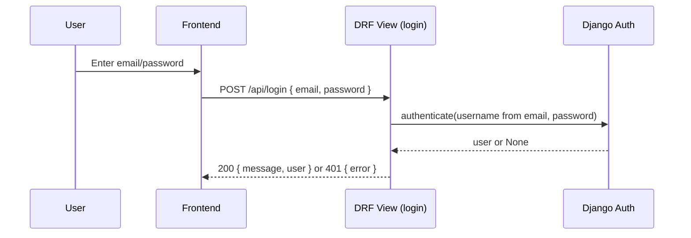
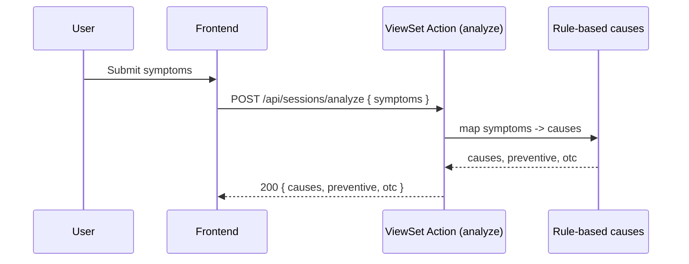
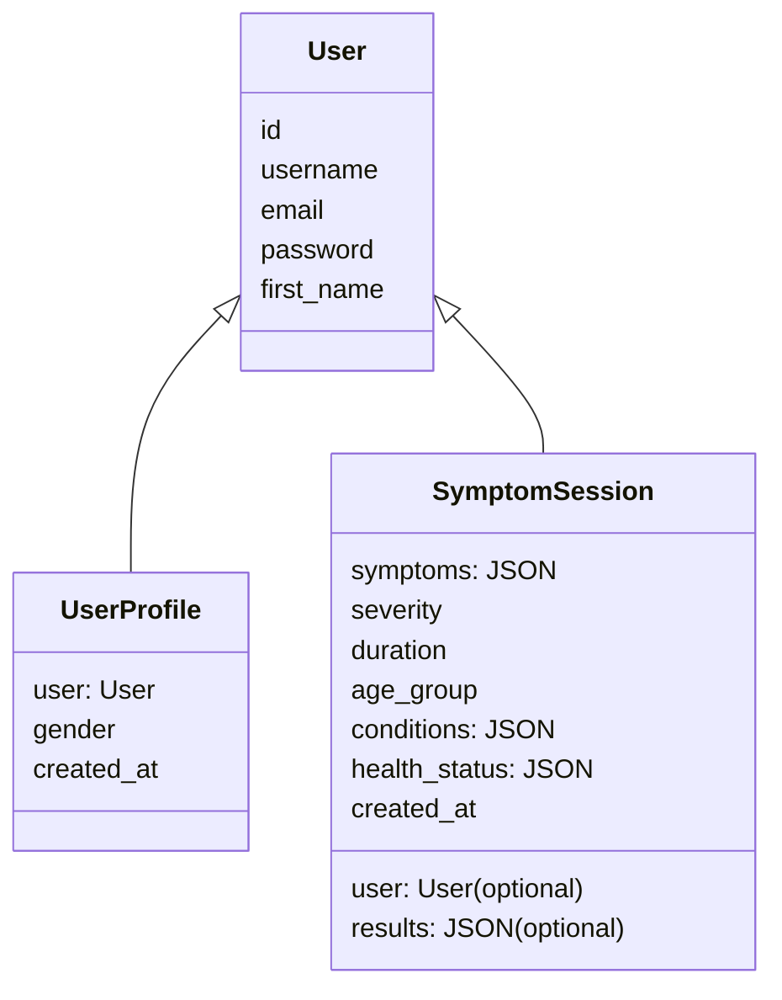

# Design

## Architecture

```mermaid
graph TD
    subgraph Client
        A[Browser]
        B[Frontend<br/>HTML/CSS/JS]
    end

    subgraph Backend (Django + DRF)
        C[API Endpoints]
        C1[/POST /api/register/]
        C2[/POST /api/login/]
        C3[/CRUD /api/sessions/]
        C4[/POST /api/sessions/analyze/]
        D[Views & ViewSets]
        E[Serializers]
        F[Models]
    end

    subgraph Data Store
        G[(MySQL)]
    end

    A --> B
    B -->|JSON fetch| C
    C --> D
    D --> E
    D --> F
    F --> G
```

## Sequence: Login



## Sequence: Symptom Analyze



## Data Model



## Components and References

- Backend
  - Settings: [settings.py](file:///c:/Users/sr552/Downloads/Medical%20Assistant/Backend/medguide/settings.py)
  - URLs: [urls.py](file:///c:/Users/sr552/Downloads/Medical%20Assistant/Backend/medguide/urls.py)
  - Views: [views.py](file:///c:/Users/sr552/Downloads/Medical%20Assistant/Backend/api/views.py)
  - API URLs: [api/urls.py](file:///c:/Users/sr552/Downloads/Medical%20Assistant/Backend/api/urls.py)
  - Models: [models.py](file:///c:/Users/sr552/Downloads/Medical%20Assistant/Backend/api/models.py)
  - Serializers: [serializers.py](file:///c:/Users/sr552/Downloads/Medical%20Assistant/Backend/api/serializers.py)
  - Migrations: [migrations](file:///c:/Users/sr552/Downloads/Medical%20Assistant/Backend/api/migrations)

- Frontend
  - Entry: [index.html](file:///c:/Users/sr552/Downloads/Medical%20Assistant/Frontend/index.html)
  - API helper: [api.js](file:///c:/Users/sr552/Downloads/Medical%20Assistant/Frontend/js/api.js)
  - App logic: [app.js](file:///c:/Users/sr552/Downloads/Medical%20Assistant/Frontend/js/app.js)
  - Styles: [style.css](file:///c:/Users/sr552/Downloads/Medical%20Assistant/Frontend/css/style.css)
